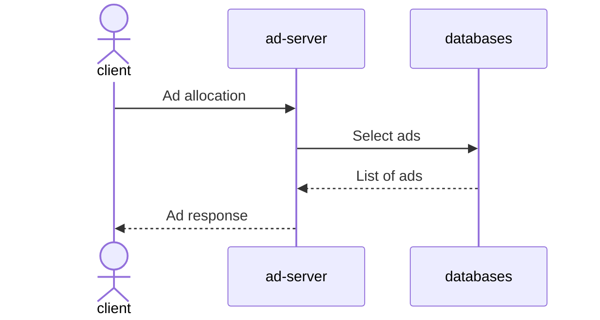
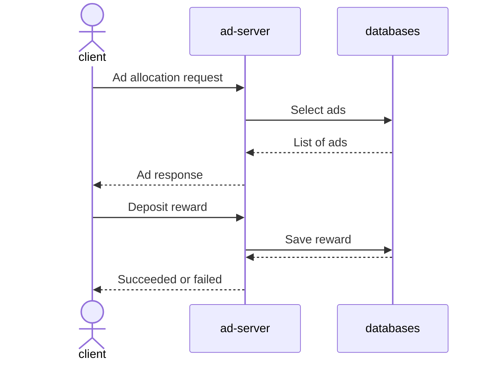

# 개요
광고 리워드 서버를 만들어보자

# 광고 서버 구현하기
클라이언트는 서버에 광고 송출 요청을 보내 광고의 리스트를 반환받습니다.

**DB**
campaign

| Key              | Value                                                                  |
| ---------------- | ---------------------------------------------------------------------- |
| id               | 광고를 구분하는 고유 아이디.                                                  |
| name             | 광고의 이름                                                               |
| image_url        | 유저에게 보일 광고의 이미지 주소.                                              |
| landing_url      | 광고를 클릭했을 때 최종으로 유저가 랜딩 되어야 할 광고주 페이지.                       |
| weight           | 광고의 송출 가중치로 값이 클수록 첫 번째에 보일 확률이 높습니다.                     |
| target_country   | 광고가 송출 가능한 국가 정보입니다.                                             |
| target_gender    | 광고의 성별 타게팅 정보입니다. M: 남자 타게팅, F: 여자 타게팅                       |
| reward           | 광고를 클릭했을 때 받을 수 있는 리워드입니다.                                     |

# 추천 로직 구현하기
| 이름 | 설명 |
| - | - |
| random | 랜덤으로 정렬하는 정책 |
| weight | weight 기반 정책 |

**광고 송출 weight구현**
- 광고 정보의 country, gender 조건에 맞는 광고만 송출됩니다.
- 광고는 한 번에 최대 3개까지 송출이 되며 3개의 순서는 weight 값에 의해 정해집니다. 만약 광고 a, b, c, d의 각 weight가 1, 1, 2, 3인 경우 a는 1/7, b는 1/7, c는 2/7의, d는 3/7의 확률로 처음에 위치해야 합니다. 두 번째, 세 번째 광고도 마찬가지로 weight에 의해 선택됩니다.

**광고 송출 그룹**  
광고 송출 시 user_id 값을 송출 방법 수로 나눈 나머지 값에 따라 정책을 선택합니다. 즉 유저는 2개의 그룹으로 나뉘고 각 그룹은 한 가지 정책으로만 송출됩니다.
user 1은 1그룹 -> random  
user 2는 2그룹 -> weight  

# 리워드 적립 기능 구현하기
유저는 광고를 볼 때 얼마의 리워드를 받을 수 있는지 알 수 있으며 광고를 클릭하면 리워드가 적립됩니다. 또한 적립한 리워드를 사용하는 것도 가능합니다.

## 필요 API
다음과 같은 리워드 API를 구현합니다.

| API 항목 | 설명 |
| - | - |
| 리워드 적립 API | 특정 유저에게 리워드를 적립합니다. |
| 리워드 차감 API | 특정 유저의 리워드를 사용합니다. |
| 리워드 내역 확인 API | 특정 유저의 최근 일주일의 리워드 적립/차감 내역을 보여줍니다. |
| 리워드 잔액 확인 API | 특정 유저가 보유하고 있는 리워드의 잔액을 보여줍니다. |

리워드 API는 다음과 같은 조건을 만족해야 합니다.
- 한 번 송출받은 각각의 광고에 대해 리워드 적립은 한 번만 허용됩니다. 하지만 다시 광고 송출을 받은 경우 리워드 적립을 받을 수 있습니다.
- 리워드 잔액은 음수가 될 수 없습니다.
- 유저는 부정한 방법으로 리워드를 받을 수 없습니다.

## 추가 구현
- 부정한 방법으로 리워드를 받을 수 없도록 하기
